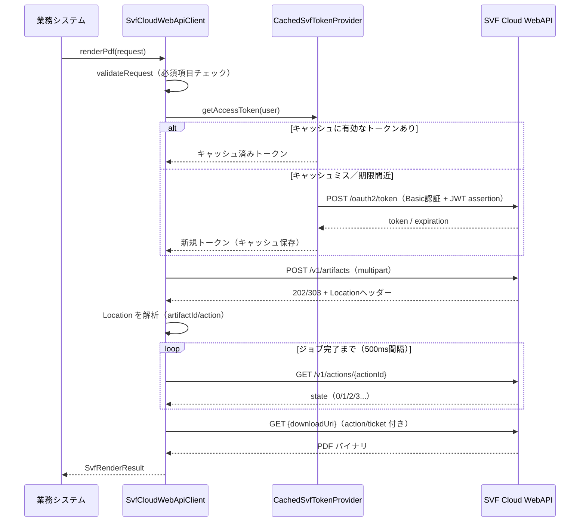

# SVF Cloud 通信パッケージ（svf）外部設計書

| 項目 | 内容 |
|---|---|
| パッケージ | `com.example.svf.svf` |
| モジュール | SVF Cloud クライアントモジュール |
| 対象ファイル | `backend/src/main/java/com/example/svf/svf/**` |
| 関連クラス | `com.example.svf.config.SvfCloudProperties` |

---

## 1. 概要と責務

### 1.1 目的

本パッケージは、SVF Cloud WebAPI との通信処理を完全に隠蔽し、
業務システム（帳票管理側）に対して **「帳票テンプレート＋データ → PDF」** という
シンプルな機能のみを提供することを目的とする。

### 1.2 責務範囲

| 区分 | 内容 |
|---|---|
| 本パッケージの責務 | OAuth 認証（JWT bearer grant）、JWT assertion 生成・署名、アクセストークンの取得とキャッシュ、印刷ジョブ登録、完了ポーリング、生成物ダウンロード、エラーの統一変換 |
| 業務システムの責務 | `SvfRenderRequest` の組み立てと `SvfCloudClient.renderPdf()` の呼び出し、返却された PDF の利用。認証・HTTP・プロトコル詳細は**一切扱わない** |

### 1.3 設計原則

- **隠蔽**: multipart 組み立て・状態ポーリング・HTTP エラー変換などの低レベル詳細はパッケージ内部に完結する
- **インターフェース分離**: 業務システムは `SvfCloudClient` インターフェースと model クラスのみに依存する
- **実行ユーザーの正しさ**: すべての処理は実行ユーザー（`SvfUserContext`）単位で行われ、SVF Cloud の実行履歴に正しいユーザーが記録される

---

## 2. パッケージ構成と依存関係

### 2.1 パッケージ構成

```
com.example.svf.svf
├── SvfCloudClient               公開インターフェース（renderPdf のみ）
├── SvfCloudWebApiClient         SvfCloudClient の WebAPI 実装
├── SvfTokenProvider             トークン提供者インターフェース
├── CachedSvfTokenProvider       トークン取得＋ユーザー単位キャッシュ実装
├── SvfJwtAssertionFactory       JWT assertion 生成インターフェース
├── DefaultSvfJwtAssertionFactory JWT assertion 生成・RS256 署名実装
├── SvfCloudException            SVF Cloud 関連の統一例外
└── model/
    ├── SvfRenderRequest         レンダリング要求（入力）
    ├── SvfRenderResult          レンダリング結果（出力）
    ├── SvfRenderOptions         オプション（タイムアウト・ポーリングなど）
    └── SvfUserContext           実行ユーザー情報
```

### 2.2 クラス図（主要な依存関係）

```
業務側(ReportService)
    │ 依存: SvfCloudClient（インターフェース）, model
    ▼
SvfCloudClient ◄──── SvfCloudWebApiClient
                            │ 依存
                            ▼
                     SvfTokenProvider ◄──── CachedSvfTokenProvider
                                                  │ 依存
                                                  ▼
                                          SvfJwtAssertionFactory ◄──── DefaultSvfJwtAssertionFactory
```

- `SvfCloudWebApiClient` は `SvfTokenProvider` にのみ依存し、JWT 生成の詳細は知らない
- `CachedSvfTokenProvider` は `SvfJwtAssertionFactory` にのみ依存し、署名方式の詳細は知らない
- すべての実装は `SvfCloudProperties`（`svf.cloud.*` 設定）をコンストラクタ注入で受け取る

---

## 3. 公開インターフェース仕様

### 3.1 公開 API

```java
public interface SvfCloudClient {
    SvfRenderResult renderPdf(SvfRenderRequest request);
}
```

この1メソッドのみが公開 API である。処理の成否は戻り値または `SvfCloudException` で伝達する。

### 3.2 入力: SvfRenderRequest

| フィールド | 型 | 必須 | SVF Cloud 側パラメータ | 説明 |
|---|---|---|---|---|
| artifactName | String | ○ | `name` | 生成物の名前（本システムでは「帳票名-番号」形式） |
| formPath | String | ○ | `defaultForm` | 帳票フォームパス（例: `form/Practice/Report.xml`） |
| csvData | String | ○ | `data/report.csv` パート | 帳票に流し込む CSV データ |
| user | SvfUserContext | ○ | JWT の sub / userName | 実行ユーザー情報 |
| options | SvfRenderOptions | × | printer / source / timeout / redirect | null の場合は PDF/CSV デフォルトを適用 |

### 3.3 入力: SvfRenderOptions（補正ルール付き）

| フィールド | 型 | SVF Cloud 側パラメータ | 補正ルール（resolved*） |
|---|---|---|---|
| timeoutSeconds | int | `timeout` | ≤0 → 60 秒 |
| redirect | boolean | `redirect` | なし |
| printer | String | `printer` | null/空 → "PDF" |
| source | String | `source` | null/空 → "CSV" |
| pollIntervalMillis | long | （クライアント側動作） | ≤0 → 500ms（実行時は最小 100ms を保証） |

デフォルト生成: `SvfRenderOptions.pdfCsvDefault()` =
（60秒, redirect=false, printer="PDF", source="CSV", 500ms）

クライアントはジョブ完了まで常にポーリングする（一律同期処理）。
呼び出し側は完全なオブジェクトを作る義務を負わず、`resolved*()` メソッド経由で
常に妥当な値が SVF Cloud に送信される。

### 3.4 入力: SvfUserContext

| フィールド | 型 | 必須 | 説明 |
|---|---|---|---|
| userId | String | ○ | SVF Cloud の sub クレーム値（例: `zhangsan@example.com`） |
| userName | String | ○ | SVF Cloud の userName クレーム値（例: `张三`） |

### 3.5 出力: SvfRenderResult

| フィールド | 型 | 説明 |
|---|---|---|
| pdf | byte[] | 生成された PDF バイナリ（ダウンロード本体） |
| artifactId | String | SVF Cloud が割り当てた生成物 ID。障害調査時の特定に使用可能 |
| actionId | String | 印刷ジョブの実行記録 ID。SVF Cloud の実行履歴（Activity History）に対応 |

> 現在の呼び出し側（ReportService）は `getPdf()` のみを使用する。
> artifactId / actionId はログ記録・障害調査（SVF Cloud 実行履歴との突合）のために保持する。
> PDF バイナリはコンストラクタと `getPdf()` の両方で防御的コピーを行い、外部からの配列書き換えによる内容・ハッシュ値の変動を防ぐ。

---

## 4. 処理シーケンス

### 4.1 全体シーケンス



### 4.2 ステップ別仕様

#### ① トークン取得 — `POST /oauth2/token`

| 項目 | 内容 |
|---|---|
| Content-Type | `application/x-www-form-urlencoded` |
| 認証ヘッダー | `Basic base64(clientId:secret)` |
| フォーム本文 | `grant_type=urn:ietf:params:oauth:grant-type:jwt-bearer`（RFC 7523）<br>`assertion=署名済みJWT` |
| 応答 | `{ "token": "...", "expiration": 有効期限 }`（両方必須、欠落時は応答不正扱い）。expiration は公式レスポンス例がエポックミリ秒（13桁）である一方、説明文中には秒と読める記載もあるため、クライアントは桁数の境界判定で両形式を受け入れる（実環境の単位が確定したら固定解釈に置き換える） |

#### ② 印刷ジョブ登録 — `POST /v1/artifacts`

| multipart パート | 値 |
|---|---|
| name | artifactName |
| printer | resolvedPrinter() |
| source | resolvedSource() |
| defaultForm | formPath |
| timeout | resolvedTimeoutSeconds() |
| redirect | redirect |
| data/report.csv | csvData（ファイルパートとして添付） |

- 正常応答: **202 Accepted** または **303 See Other** ＋ Location ヘッダー
- Location 形式: `{base}/v1/artifacts/{artifactId}?action={actionId}&ticket={ticket}`
- Location ヘッダーから本文ではなくヘッダーを読むため、`exchange()` を使用

#### ③ 完了ポーリング — `GET /v1/actions/{actionId}`

| state | 意味 | クライアント動作 |
|---|---|---|
| 0 | 未処理 | 待機（再ポーリング） |
| 1 | 処理中 | 待機（再ポーリング） |
| 2 | 完了 | ポーリング終了、ダウンロードへ |
| 3 / 5 / 6 | 終端失敗状態 | 即時 `SvfCloudException` |
| 11 / 21 / 22 / 31 等 | 準備中・作成中・作成完了・ダウンロード中等の中間状態 | 正常な処理途中のため待機（再ポーリング） |

- 失敗判定は終端失敗状態（3 / 5 / 6）のホワイトリスト方式。それ以外の未知の値も処理途中とみなしポーリングを継続する（公式の印刷ステータス一覧に基づく）
- タイムアウト: `resolvedTimeoutSeconds()` 経過で `SvfCloudException`

#### ④ 生成物ダウンロード — `GET {downloadUri}`

- Location の URI をそのまま使用（action / ticket クエリパラメータを含む）
- 空の応答（null または 0 バイト）は応答不正として例外化

---

## 5. 実行ユーザーの伝搬経路

本システムでは、フロントエンドでログインした業務ユーザーの ID が
SVF Cloud の実行履歴・生成 PDF まで一貫して伝搬する。

```
Angular ログイン（JWT を localStorage に保存）
    │ Authorization: Bearer ヘッダー
    ▼
Spring Security（JwtAuthenticationFilter が検証）
    │ Authentication の principal = AuthenticatedUser
    ▼
ReportController.resolveUser()
    │ principal → SvfUserContext(userId, userName)
    ▼
SvfRenderRequest.user
    ▼
DefaultSvfJwtAssertionFactory（JWT の sub / userName クレーム）
    ▼
SVF Cloud 実行履歴・生成 PDF（実行ユーザーとして表示）
```

**設計上の要点**: トークンはユーザー単位で発行・キャッシュされるため、
SVF Cloud 側の実行履歴に「どの業務ユーザーが実行したか」が正しく記録される。
これは本設計の核となる要件である。

---

## 6. エラーハンドリング方針

### 6.1 基本方針

- SVF Cloud 関連のエラーは **すべて `SvfCloudException`（実行時例外）に統一**して送出する
- HTTP ステータス・RestClient の例外・IO 例外などはパッケージ外に漏れない
- 業務システム側は `SvfCloudException` の捕捉のみでよい

### 6.2 エラー分類

| 分類 | 検出タイミング | 例 |
|---|---|---|
| 要求検証エラー | HTTP 呼び出し前（フェイルファスト） | request/artifactName/formPath/csvData/user が空 |
| 認証エラー | トークン取得時 | `/oauth2/token` の HTTP エラー、応答不正 |
| 署名エラー | assertion 生成時 | real モードでの秘密鍵パス未設定・読み込み失敗 |
| ジョブ登録エラー | ジョブ登録時 | 202/303 以外のステータス、Location ヘッダー欠落・不正 |
| ジョブ失敗 | ポーリング時 | state = 3 / 5 / 6（終端失敗状態） |
| タイムアウト | ポーリング時 | `resolvedTimeoutSeconds()` 超過 |
| ダウンロードエラー | 生成物取得時 | HTTP エラー、空のアーティファクト |
| 割り込み | ポーリング待機中 | `InterruptedException` → 例外化＋割り込み状態復元 |

### 6.3 例外メッセージ

- エラーメッセージには原因特定に十分な情報（HTTP ステータス、actionId、state、Location の値）を含める
- 原因例外が存在する場合は `cause` として保持する

---

## 7. キャッシュ戦略と並行制御

### 7.1 トークンキャッシュ（CachedSvfTokenProvider）

| 項目 | 設計 |
|---|---|
| キャッシュ単位 | **実行ユーザー単位**（SVF Cloud のトークンはユーザー単位発行のため） |
| キャッシュキー | `userId + "\u0000" + userName` の連結（区切り文字で衝突防止） |
| 保存先 | メモリ内（Caffeine キャッシュ） |
| エントリ上限 | maximumSize = 1000。超過時は使用頻度の低いエントリから退去 |
| 期限退去 | expireAfterWrite = トークン有効期限（`svf.cloud.token-expiration-seconds`、既定 3600 秒）。未使用エントリは自動的に削除される |
| 期限判定 | 有効期限の **60 秒前**（EXPIRATION_BUFFER_SECONDS）になったら期限間近とみなす。判定は注入された `Clock` に基づく（テストで固定時刻に差し替え可能） |
| 並行制御 | `asMap().compute` による**キャッシュキー単位のアトミックなチェック＆リフレッシュ**（有効性判定→再取得を単一操作で実施）。同一ユーザーの同時要求ではトークン取得が 1 回にまとまる。ロード中の例外時は既存エントリを保持し、期限切れエントリは次回呼び出しで再試行される |

### 7.2 制約事項

- メモリ内キャッシュのため、アプリケーション再起動でキャッシュは失われる（再起動後は再取得される）
- 複数インスタンス構成では各ノードが個別にトークンを取得する（共有キャッシュは持たない）
- ログアウト時にキャッシュエントリを明示削除する仕組みはない（期限退去・上限退去に依存。フロントエンド JWT とは独立のためセキュリティ上の問題はない）

---

## 8. セキュリティ設計

### 8.1 認証方式

- **OAuth 2.0 JWT bearer grant**（RFC 7523）
- JWT assertion は **RS256（SHA256withRSA）** で署名
- 秘密鍵は **PKCS#8 形式の PEM ファイル**を使用（`svf.cloud.jwt-private-key-path` で指定）

### 8.2 JWT assertion のクレーム構成

| クレーム | 値 | 説明 |
|---|---|---|
| iss | clientId | SVF Cloud に登録したアプリケーションID |
| sub | user.userId | 実行ユーザーID |
| exp | 現在時刻 + jwtExpirationSeconds | 有効期限（エポック秒、文字列形式で送信） |
| userName | user.userName | 実行ユーザー表示名 |
| timeZone | Asia/Tokyo | 固定 |
| locale | ja | 固定 |

### 8.3 資格情報の管理

- clientId / secret / 秘密鍵パスはすべて `SvfCloudProperties`（`svf.cloud.*` 設定）経由で注入し、コードにハードコードしない
- アクセストークンはすべての WebAPI 呼び出しで `Authorization: Bearer` ヘッダーとして送信する
- ダウンロード用 ticket は一回限り有効な使い捨て凭证である

---

## 9. real / mock デュアルモード

本パッケージは `svf.cloud.mode` の切替だけで、SVF Cloud 本番環境と
内蔵 mock サーバーを切り替えられる。業務コード・クライアントコードへの変更不要。

| 観点 | real モード（`mode: real`） | mock モード（`mode: mock`、既定） |
|---|---|---|
| 接続先 | SVF Cloud（`https://api.svfcloud.com`） | 内蔵 mock サーバー（同一アプリ内の `/svf-mock`） |
| JWT 署名 | RSA 秘密鍵で実署名（**秘密鍵パス必須**） | 固定文字列 `mock-signature`（鍵不要） |
| トークン検証 | SVF Cloud が検証 | 検証なし |

### mock 専用の動作パラメータ（svf.cloud.mock-*）

| 設定 | 既定 | 用途 |
|---|---|---|
| mock-processing-delay-millis | 0 | 非同期状態の再現（ポーリング動作確認） |
| mock-force-error | false | ジョブ失敗の再現 |
| mock-rate-limit-enabled | false | レートリミットの再現 |
| mock-retry-after-seconds | 10 | レートリミット応答の Retry-After |

---

## 10. 設定一覧（svf.cloud.*）

| キー | 型 | 既定・補正 | 説明 |
|---|---|---|---|
| mode | String | mock | `real` の場合のみ本番モード（大文字小文字不問） |
| base-url | String | - | SVF Cloud（または mock）のベース URL |
| client-id | String | - | SVF Cloud アプリケーションID（JWT の iss） |
| secret | String | - | Basic 認証用のクライアントシークレット |
| user-id / user-name | String | - | 実行ユーザー未指定時のデフォルトユーザー |
| jwt-private-key-path | String | - | PKCS#8 PEM 秘密鍵パス（real モード必須） |
| jwt-expiration-seconds | Long | ≤0/未設定 → 300 | JWT assertion の有効期限 |
| token-expiration-seconds | Long | ≤0/未設定 → 3600 | アクセストークンの有効期限（mock での発行値） |

---

## 11. 拡張ポイント

| 拡張内容 | 方法 |
|---|---|
| トークン取得方式の変更（例: 共有キャッシュ化） | `SvfTokenProvider` の別実装を注入 |
| 署名方式・クレームの変更 | `SvfJwtAssertionFactory` の別実装を注入 |
| 通信先の変更（real ↔ mock） | `svf.cloud.mode` / `base-url` の設定変更のみ |
| PDF 以外の出力形式 | `printer` / `source` オプションと応答の contentType 拡張 |

---

## 12. 運用上の指針

- **ログ・監査**: `SvfRenderResult` の `artifactId` / `actionId` をログに記録すれば、
  SVF Cloud 管理画面の実行履歴（Activity History）と突合して障害調査が可能
- **タイムアウト設計**: 既定のジョブタイムアウトは 60 秒、ポーリング間隔は 500ms。
  帳票サイズに応じて `SvfRenderOptions` で調整する
- **同期処理の特性**: 現状は HTTP リクエスト内で完了まで同期ポーリングする方式。
  大量帳票の一括変換など長時間処理が必要な場合は、非同期化（キュー＋ジョブ化）の検討が必要

---

## 13. 関連ドキュメント・コード

| 名称 | パス |
|---|---|
| 公開インターフェース | `backend/src/main/java/com/example/svf/svf/SvfCloudClient.java` |
| WebAPI 実装 | `backend/src/main/java/com/example/svf/svf/SvfCloudWebApiClient.java` |
| トークンキャッシュ | `backend/src/main/java/com/example/svf/svf/CachedSvfTokenProvider.java` |
| JWT assertion 生成 | `backend/src/main/java/com/example/svf/svf/DefaultSvfJwtAssertionFactory.java` |
| モデル | `backend/src/main/java/com/example/svf/svf/model/*.java` |
| 設定定義 | `backend/src/main/java/com/example/svf/config/SvfCloudProperties.java` |
| 設定値 | `backend/src/main/resources/application.yml`（`svf.cloud.*`） |
| 呼び出し元 | `backend/src/main/java/com/example/svf/report/ReportService.java` |
